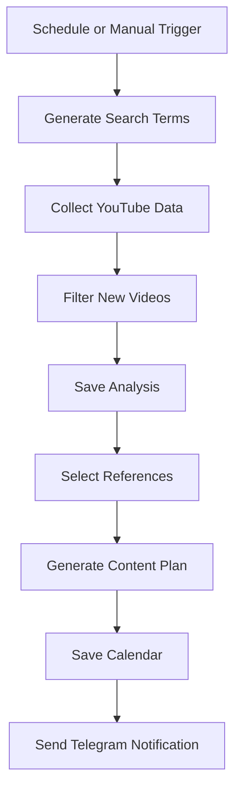

# YouTube Content Radar

An AI-assisted n8n workflow that researches YouTube videos, evaluates their performance, and generates a structured weekly content plan.

The workflow combines Gemini, the YouTube Data API, Google Sheets, and Telegram to turn topic-based research into actionable video ideas.

## Features

- Generates topic-specific search terms with Gemini
- Collects video metadata through the YouTube Data API
- Filters videos by language, region, duration, view count, and publication date
- Prevents duplicate records by checking previously analyzed video IDs
- Calculates daily average views, engagement rate, and a viral score
- Selects the strongest reference videos
- Generates titles, descriptions, keywords, target audiences, and publishing dates
- Stores research results and the content calendar in Google Sheets
- Sends a Telegram notification when the workflow finishes
- Supports scheduled and manual execution

## Workflow

## Requirements

- An n8n instance
- Google Gemini API credentials
- YouTube Data API v3 key
- Google Sheets OAuth2 credentials
- Telegram Bot credentials (optional)

## Installation

1. Download `YouTube_Content_Radar.json`.
2. Open n8n and select **Import from File**.
3. Import the workflow JSON.
4. Add your Gemini, Google Sheets, and Telegram credentials.
5. Open the `Ayarlar` node and enter your YouTube API key.
6. Select your own spreadsheets and sheets in the Google Sheets nodes.
7. Enter your Telegram chat ID or remove the Telegram node if it is not needed.
8. Run the workflow manually once before enabling the schedule.

## Configuration

The `Ayarlar` node contains the main research parameters:

| Parameter | Description |
| --- | --- |
| `kanal_konusu` | Main channel topic |
| `video_dili` | Video language code |
| `bolge_kodu` | YouTube region code |
| `haftalik_paylasim` | Number of weekly content ideas |
| `arama_terimi_sayisi` | Number of AI-generated search terms |
| `min_izlenme` | Minimum view count |
| `min_sure_saniye` | Minimum video duration in seconds |
| `son_kac_gun` | Publication-date search window |
| `yayin_saati` | Planned publishing time |
| `youtube_api_key` | Your YouTube Data API key |

## Google Sheets

The workflow uses two spreadsheets:

1. **Video analysis:** stores metadata, engagement metrics, daily average views, and viral scores.
2. **Content calendar:** stores generated ideas, titles, descriptions, keywords, target audiences, and planned publishing dates.

The first row of each sheet must contain column names matching the fields configured in the corresponding n8n Google Sheets node.

## API Quota

YouTube search requests consume significantly more quota than video-detail requests. The workflow limits the number of search terms and includes a fallback based on popular videos when the search quota is unavailable.

## Security

This repository does not contain API keys, spreadsheet IDs, chat IDs, or n8n credential references. Configure these values only inside your own n8n environment. Never commit exported workflows containing active secrets.

## Disclaimer

The viral score is a custom prioritization metric based on daily views and engagement. It is intended for content research and does not guarantee future video performance.
